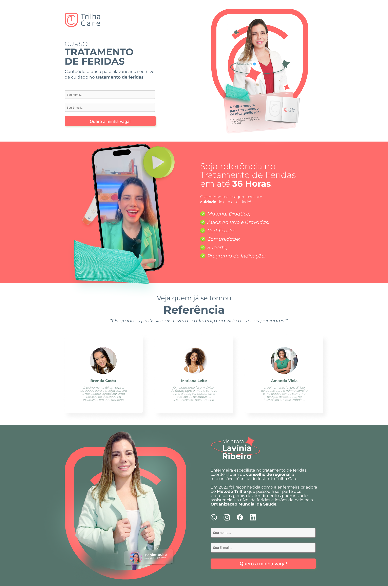

# Landing Page - Trilha Care

### Curso de Tratamento de Feridas 🎓

## índice
- <a href="#layout">Layout</a>
- <a href="#preview">Preview Online</a>
- <a href="#tecnologias">Tecnologias Utilizadas</a>
- <a href="#autores">Autores</a>

## ✒️ - Layout

##  💻  - Preview
👉 [Trilha Care](https://ciro-silva.github.io/trilha-care/)
##  🔧  - Tecnologias
1. [Figma (<i>Design</i>)](https://www.figma.com/)
2. [Html](https://developer.mozilla.org/pt-BR/docs/Web/HTML)
3. [Css](https://developer.mozilla.org/pt-BR/docs/Web/CSS)
3. [JavaScript](https://developer.mozilla.org/pt-BR/docs/Web/JavaScript)
##  😎  - Autores

[Linkedin](https://www.linkedin.com/in/ciro2023/)
<i>Ciro Silva</i>

##  🎯  - Próximos Passos
- [ ] Criar Banco de dados para armazenar os dados cadastrais dos alunos;
- [ ] Conectar o Front-end ao Backend para receber os alunos que solicitarem a vaga diretamente na landing Page;
- [ ] Fazer a sessão TESTIMONIAIS em carrossel para dar mais dinamismo à página;
- [ ] Criar este projeto em React.
